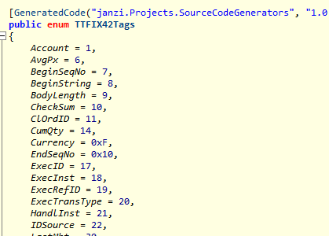

# SourceCodeGenerators

This repository contains a set of Code generators, see below.


## General Usage

To enable the source code generators you have to change the project file.

```xml
<ItemGroup>
  <ProjectReference 
      Include="..\SourceGenerator\SourceGenerator.csproj"
      ReferenceOutputAssembly="false"
      OutputItemType="Analyzer" />
</ItemGroup>
```

## AutoNotifyGenerator

Auto implementation for [`INotifyPropertyChanged`](https://docs.microsoft.com/en-us/dotnet/api/system.componentmodel.inotifypropertychanged). You only have to specify the field and mark the field with
the attribute and generator will automatically generate the property and raise the event.

I notice a strange behavior, while using the generator in a wpf UI project. The compilation failed, 
even all the setup and code was fine. Splitting in UI and ViewModel/Service project worked around this.
So you might get issues an WPF projects.

```csharp
public partial class ExampleViewModel
{
    [AutoNotify]
    private string _text = "private field text";

    [AutoNotify(PropertyName = "Count")]
    private int _amount = 5;
}
```

 becomes

```csharp
public class ExampleViewModel : INotifyPropertyChanged
{
  [AutoNotify]
  private string _text = "private field text";

  [AutoNotify(PropertyName = "Count")]
  private int _amount = 5;

  public string Text
  {
    get { return _text; }
    set
    {
      string old = _text;
      _text = value;
      if (_text != old)
      {
        this.PropertyChanged?.Invoke(this, new PropertyChangedEventArgs("Text"));
      }
    }
  }

  public int Count
  {
    get { return _amount; }
    set
    {
      int old = _amount;
      _amount = value;
      if (_amount != old)
      {
        this.PropertyChanged?.Invoke(this, new PropertyChangedEventArgs("Count"));
      }
    }
  }
  public event PropertyChangedEventHandler PropertyChanged;
}
```

## Usage

Hook up the generator, nothing else to do.

## FixXmlEnumConverter

This generator shall generate enumerations based  on the definition of the xml-based
FIX application dictionary. Usually used for QuickFix.
The fields in the xml will be converted to an enum field and tag number.
The name is base on the file name, e. g. `TT-FIX42.xml` becomes the enum `TTFIX42Tag`.



Additional enums
will be generated for the fix field enums. Because the value can be char instead of int, the
enum value is the char code.


### Usage

Reference the code generator as usual. The add the xml files you like to be converted.
In VS set the `Build Action` property of the xml to `C# analyzer additional file`.
Alternatively you can edit the project file and add the following code block.

```xml
<ItemGroup>
  <AdditionalFiles Include="TT-FIX42.xml" />
</ItemGroup>
```